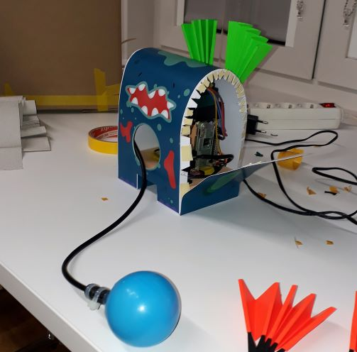

# Stressmonster
Das Stressmonster soll durch Messung seiner Umgebung und durch den Input des Menschen, anzeigen, ob eine Person gestresst ist. Für die Umsetzung des Prototypen wurde nur eine Komponente für die Messung des Stresses gewählt. Diese Messung geschieht mit Hilfe eines Stressballs, der sich in dem Bauch des Monsters befindet. Der Benutzer kann diesen Ball nehmen und ihn drücken und dadurch signaliseren, dass er gestresst ist. Der Stresslevel des Benutzers wird über eine Weboberfläche und über faltbare Fächer, die das Monster besitzt, angezeigt. Steigt der Druck so erhöht sich die Anzeige und die Fächer des Monsters fahren aus.
Das Drücken vom Ball wird durch einen Luftdrucksensor registiert. Die Messdaten, die dieser Drucksensor liefert werden weitergeleitet um das Stresslevel daraus abzuleiten.


*Webinterface*




*Stressmonster*
## Hardware
Die Hardware besteht aus einem XMC2Go mit Drucksensor, einem Raspberry Pi und zwei Servomotoren. Der XMC2Go misst Druckdaten und schickt diese an an den Raspberry Pi, der sie auswertet und weiterverarbeitet. Über den Raspberry werden zusätzlich zwei Servomotoren angesteuert, die die Fächer des Stressmonsters bewegen.
### XMC2Go mit DPS310 Drucksensor
Der XMC2Go nimmt Daten eines Drucksensors auf, der in dem Stressball eingebaut ist.
Der Drucksensor ist durch ein längeres Kabel mit dem XMC2Go verbunden. Die genaue Pin-Belegung ist:
Die Messdaten werden per UART an den Raspberry übertragen.
### RaspberryPi Zero/W
Der Raspberry Pi Zero/W besitzt einen kleinen Formfaktor und Schnittstellen, die benötigt werden um alle Hardwarekomponeten zu verbinden. Außerdem ist es möglich, durch das Wlan-Moduls des Raspberrys einen eigenen Access-Point zu öffnen. Dadurch kann man sich mit einem externen Gerät per WLan auf dem Raspberry einloggen und Daten übertragen.

Die einzige Schwäche des Raspberrys ist die Kontrolle der Servomotoren. Hierfür sind präzise PWM-Signale nötig, die auf dem Raspberry nicht einfach erzeugt werden können. Deswegen muss man sich leider mit sog. Software-PWM begnügen, die aber Schwankung in der Freqeunz aufweisen. Das macht sich durch gelegentliches Zittern der Servomotoren bemerkbar. Für einen ersten Prototypen ist diese Art der Servoansteuerung aber ausreichend. Wenn man aber eine bessere Kontrolle möchte, sollte man evtl. noch einen Mikrocontroller für die Servomotoren vorsehen.
### Servomotor Tower Pro MG995


Es handelt sich Motoren wie sie auch in RC-Autos zu finden sind. Die Ansteuerung wird mit PWM-Signale bewerkstelligt. Sie lassen sich in einem Radius von 180 Grad drehen.
### Aufbau


#### Verkabelungsplan
Der Raspberry Pi ist die Basis für alle Komponeten. Als Kommuniktaionsschnittstelle mit dem XMC2Go wird UART genutzt. Die Servos werden über die GPIO-Pins 18 und 13 des Raspberrys betrieben. Als Spannungsversorgung für die Servos dienen die 5V Pins.


#### Einbau des Sensors im Stressball
Um den Druck im Stressball lesen zu können, muss der Ball, nachdem der Sensor eingebaut wurde, wieder luftdicht verschlossen werden. Ansonsten ist der Druckausgleich zu schnell und es können keine Druckunterschiede festgestellt werden. Zum versiegeln der Öffnung für das Kabel kann Epoxidhartz genutzt werden.

## Software
Um das Zusammenspiel der Komponenten zu vereinfachen, wurde bei allen ein Delay von 500 ms eingefügt. Das bedeutet natürlich, dass das Stressmonster entsprechend langsam reagiert. Mit mehr Entwicklungszeit kann das behoben werden.
### Druckdaten von Sensor auslesen
Die Druckdaten werden vom XMC2Go alle 500 ms ausgelesen und an den Raspberry Pi per UART übertragen. Dabei wird das SLIP-Protokoll genutzt.
```c++
#include <Arduino.h>
#include <Dps310.h>
#include <PacketSerial.h>

/*
  Stressmonster Pressure measuring
  Collects pressure data and sends the data via Uart to the PC

  file edited by :Johannes Maier
  mail:ton.maier@gmail.com

  Additional library:
  PacketSerial by Christopher Baker
*/

/*
  Package Handler with SLIP Protocol
  Simple Package Encoder/Decoder, less overhead than asci
*/ 
SLIPPacketSerial MyPacketSerial;

// Pressure data in Pascal. For Hectopascal divide with 100
// Pressure data is 24 bit long -> 120000 Pa
// Dps310 Opject

Dps310 PressureSensor = Dps310();

// Timer variable
unsigned long previousMillis = 0;
const long intervalMillis = 500;

void onPacketReceived(const uint8_t* buffer, size_t size)
{
    // Process your decoded incoming packet here.
}

void setup()
{
  MyPacketSerial.begin(9600);
  MyPacketSerial.setPacketHandler(&onPacketReceived);
  while (!Serial);

/*********************************************************************
  Call begin to initialize Dps310PressureSensor
  The parameter 0x76 is the bus address. The default address is 0x77 and does not need to be given.
  Dps310PressureSensor.begin(Wire, 0x76);
  Use the commented line below instead to use the default I2C address. 
  ********************************************************************/
  PressureSensor.begin(Wire);


  int16_t temp_mr = 2, temp_osr = 2, prs_mr = 5, prs_osr = 2;
  int16_t ret = PressureSensor.startMeasureBothCont(temp_mr, temp_osr, prs_mr, prs_osr);

/**********************************************************************************************
  temp_mr = temperature measure rate (value from 0 to 7)
  2^temp_mr temperature measurement results per second

  temp_osr = temperature oversampling rate (value from 0 to 7)
  2^temp_osr internal temperature measurements per result
  A higher value increases precision

  prs_mr = pressure measure rate (value from 0 to 7)
  2^prs_mr pressure measurement results per second

  prs_osr = pressure oversampling rate (value from 0 to 7)
  2^prs_osr internal pressure measurements per result
  A higher value increases precision

  startMeasureBothCont enables background mode
  temperature and pressure ar measured automatically
  High precision and hgh measure rates at the same time are not available.
  Consult Datasheet (or trial and error) for more information

  Use one of the commented lines below instead to measure only temperature or pressure
  int16_t ret = Dps310PressureSensor.startMeasureTempCont(temp_mr, temp_osr);
  int16_t ret = Dps310PressureSensor.startMeasurePressureCont(prs_mr, prs_osr);
*************************************************************************************************/

  if (ret != 0)
  {
    Serial.print("Init FAILED! ret = ");
    Serial.println(ret);
  }
  else
  {
    Serial.println("Init complete!");
  }
}

void loop() { 
  unsigned char pressureCount = 20;
  int32_t pressure[pressureCount];
  unsigned char temperatureCount = 20;
  int32_t temperature[temperatureCount];
  
  unsigned long currentMillis = millis();

  if (currentMillis - previousMillis >= intervalMillis) {
    previousMillis = currentMillis;

    /************************************************************************************************************
    This function writes the results of continuous measurements to the arrays given as parameters
    The parameters temperatureCount and pressureCount should hold the sizes of the arrays temperature and pressure when the function is called
    After the end of the function, temperatureCount and pressureCount hold the numbers of values written to the arrays
    Note: The Dps310 cannot save more than 32 results. When its result buffer is full, it won't save any new measurement results 
    ***************************************************************************************************************/
    int16_t ret = PressureSensor.getContResults(temperature, temperatureCount, pressure, pressureCount);
  
    if (ret != 0)
    {
        Serial.println();
        Serial.println();
        Serial.print("FAIL! ret = ");
        Serial.println(ret);
    }
    else
    //sending data
    {
      MyPacketSerial.send((uint8_t*)pressure,pressureCount*4);
    }
  }
}
```
### Druck aufzeichnen auf dem RaspberryPi
Es wird das packetserial Modul aus **Simples Datenprotokoll für UART** genutzt. Das Programm errechnet aus den Druckwerten einen Mittelwert. Dieser wird mit dem Atmosphärendruck verglichen und Anhand der Abweichung wird ein Stresslevel-Wert gebildet, der dann auf dem Webinterface angezeigt wird. Die Werte werden in einer CSV-Datei gespeichert auf die das Webinterface zugriff hat.
```python
import packetserial_slip
import struct
import csv
import numpy
import time

#import threading

'''
  Stressmonster pressure recording file

  collects data, calculates stress_level and stores the results in a csv-file.

  csv-file used by node-red

  file edited by :Johannes Maier
  mail:ton.maier@gmail.com
'''

# Every 500 ms some data currently. This can be changed through the Source-code of the MCU
# Remember the UART-Bit Rate

# Values are calculated and stored in csv-file

get_pressure_packages = packetserial_slip.get_packages
pressure_data = []
got_atmospheric_pressure = False
atmospheric_pressure = 0.0
pressure_ball = 0.0
previous_p_ball= 0.0

def bytes_to_samples(byte_data, sample_width = 4, fmt = 'i'):
    if len(byte_data) % sample_width == 0 :
        samples_length = str(len(byte_data)//sample_width)
        return struct.unpack('<'+ samples_length + fmt,byte_data)
    else :
        return False

# Calculates mean pressure
def mean_pressure(pressure_data):
    mean_values =[]
    for sample in pressure_data:
        mean_values.append(numpy.mean(sample))
    return numpy.mean(mean_values)

# Calculates Stress-Level depending on the atmospheric pressure and the pressure inside the ball
def calc_stress(pressure_ball,atmospheric_pressure):
    stress_level = (pressure_ball - atmospheric_pressure)*(100/500) # random const value
    return stress_level

with  open('/home/pi/stressmonster_ws/src/pressure.csv', 'w', newline='') as csvfile:
    fieldnames = ['pressure_mean_value', 'pressure_atmosphere', 'stress_level']
    writer = csv.DictWriter(csvfile, fieldnames=fieldnames)

    while not got_atmospheric_pressure:
        data_packages = get_pressure_packages()
        if data_packages:
            for byte_package in data_packages:
                samples = bytes_to_samples(byte_package)
                if samples:
                    pressure_data.append(samples)
                    if len(pressure_data) >=10 :
                        atmospheric_pressure = mean_pressure(pressure_data)
                        got_atmospheric_pressure = True
                        pressure_data.clear()
        else : continue

    while True:
        data_packages = get_pressure_packages()
        if data_packages:
            for byte_package in data_packages:
                samples = bytes_to_samples(byte_package)
                if samples:
                    pressure_data.append(samples)
                    if len(pressure_data) >=10:
                        pressure_ball = mean_pressure(pressure_data)

                        if pressure_ball > (atmospheric_pressure + 10) or previous_p_ball > (atmospheric_pressure + 10) :
                            if pressure_ball < previous_p_ball :
                                pressure_ball = previous_p_ball
                                pressure_ball -= 10
                                previous_p_ball = pressure_ball
                            else:
                                previous_p_ball = pressure_ball    

                        else: 
                            pressure_ball = atmospheric_pressure
                            previous_p_ball = atmospheric_pressure

                        stress_level = calc_stress(pressure_ball,atmospheric_pressure)
                        writer.writeheader()
                       
                        #Namensgebung nicht ganz korrekt, da durch die If-Schleife vorher ein Filter niedrigere Werte als den Atmosphärendruck nicht abspeichert
                        writer.writerow({'pressure_mean_value': int(pressure_ball),'pressure_atmosphere': int(atmospheric_pressure),'stress_level':int(stress_level)})
                        csvfile.seek(0,0)
                        pressure_data.clear()
        else : continue
        time.sleep(0.5)    # vorlaeufige Methode
```

### Webinterface
Über das Webinterface wird das Stresslevel angezeigt. Das Interface ist so aufgebaut, das es einfach über einen Browser, wie er in jedem Handy zu finden ist, aufgerufen werden kann. Für die Umsetzung wird **Node-Red** verwendet.

Das Webinterface greift alle 500 ms auf die CSV-Datei zu, die durch die Druckaufzeichnung erstellt wird, liest die Daten aus und stellt sie in der UI entsprechend da.
Zusätzlich besitzt das Webninterface noch zwei Knöpfe mit denen die Servos auf einen bestimmten Winkel, der aus dem Stresslevel resultiert, eingestellt werden können.
### Servoansteuerung
Zum jetzigen Zeitpunkt können die Servos nur manuel bedient werden. Der Grund dafür ist, das für eine automatische Ansteuerung, mehr Zeit benötigt wird. Die momentane Variante dient nur dazu, die Funkion des Fächers vorzuführen. Die Servomotoren werden über das Webinterface angesteuert. Dabei wird der Wert des Stresslevels in einen Winkel umgerechnet, den die Servos ansteuern sollen. Dieser Winkel kann bis zu 110 Grad betragen.
```python
import sys
from gpiozero import AngularServo
from time import sleep

# Just for demonstration, lots of delay , Not suitable for stable PWM

'''
  Stressmonster servo control file

  file edited by :Johannes Maier
  mail:ton.maier@gmail.com
'''

stress_level = float(sys.argv[1])
if stress_level > 100 :
    stress_level =100
angle = stress_level * 110/100 -20

servo_left = AngularServo(18,initial_angle = angle,min_angle=90,max_angle=-90, min_pulse_width= 1/1000, max_pulse_width=2.5/1000)
servo_right = AngularServo(13,initial_angle = angle,min_angle=-90,max_angle=90, min_pulse_width= 1/1000, max_pulse_width=2.5/1000)
sleep(3)

servo_left.close()
servo_right.close()
```
Es wird die Bibliothek **gpio.zero** genutzt um die Pins des Raspberry anzusprechen.

